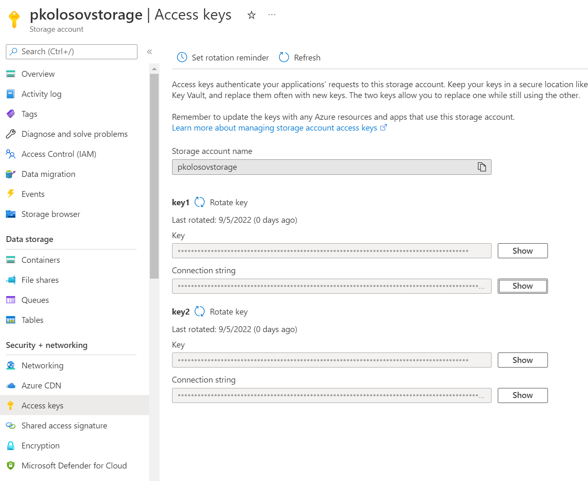

# Storage Queue Demo

This project is done in scope of my preparation to the AZ-204 exam, its main aim is to collect most
important info in terms of azure storage queues and express it as simple as possible.

## Project structure

The key components are:

- Azure storage account (General purpose v2)
- Azure storage queue
- Message sender application (.NET)
- Message consumer application (.NET)

## Managing infrastructure

Obviously, we have to maintain a basic azure infrastructure such as azure storage account + queue.
Let's perform it using azure CLI following the commands

- `az login`
- `az account set --subscription <id or name>`
- `az group create --name "storage-queue-demo-rg" --location "westus"`
- `az storage account create --name "pkolosovstorage" --resource-group "storage-queue-demo-rg"`
- `az storage queue create --name "pkolosov-storage-queue" --account-name "pkolosovstorage"`

So the infrastructure is utilized.

## Required Nuget packages

- `Azure.Storage.Queues`

To install: `dotnet add package Azure.Storage.Queues`

## Settings

Both apps, consumer and sender must have azure storage account connection string of the following format

- `DefaultEndpointsProtocol=https;AccountName=pkolosovstorage;AccountKey=;EndpointSuffix=core.windows.net`
- Set it as environment variable using powershell: `$env:AZURE_STORAGE_ACCOUT = 'DefaultEndpointsProtocol=https;AccountName=pkolosovstorage;AccountKey=;EndpointSuffix=core.windows.net'`

It could be checked at azure portal at: `storage accout -> access keys` as per screenshot below

  

